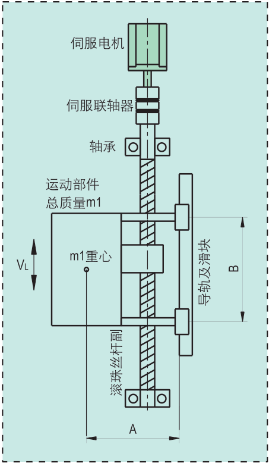
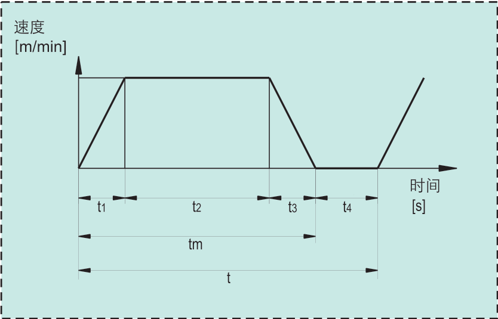

# 丝杆垂直运动负载计算和伺服选型设计

|                     机构模型示意图                      |                      时间位移曲线                       |
| :-----------------------------------------------------: | :-----------------------------------------------------: |
|  |  |

## 条件

1. 直线运动部的总质量m1=30kg。
2. 直线运动部的最高速度VL=30m/min。
3. 电气停止精度δ=±0.01mm。
4. 滑块摩擦系数μ1=0.1。
5. 机械传动链总效率η1=0.9。
6. 滚珠丝杆副未预紧时的效率η2=0.9。
7. 滚珠丝杆的长度L1=1m。
8. 传动长度L2=0.8m。
9. 滚珠丝杆的直径d1=0.02m。
10. 滚珠丝杆的导程Ph=0.01m。
11. 滚珠螺杆的密度ρ=7.9×103kg/m3。
12. 运行周期t=2.5s。
13. 加减速时间t1=t3=0.1s。

## 计算

### 运动曲线

​	由：
$$
L_2
=\frac{1}{2}\times \frac{V_L}{60}\times t_1+\frac{V_L}{60}\times t_2+\frac{1}{2}\times \frac{V_L}{60}\times t_3
$$
​	推出：
$$
t_2=\frac{60\times L_2}{V_L}-t_1=\frac{60\times 0.8}{30}-0.1=1.5s
$$
​	没分钟运行次数：
$$
N_{每分钟运行次数}=\frac{60}{2.5}=24
$$
​	加速每分钟累计运行时间：
$$
t_5=t_1\times N =0.1\times 24=2.4s
$$
​		每分钟伺服电机加速累计运行时间一般要求在10s以内，条件满足。

### 计算最高负载转速

$$
n_1=\frac{V_L}{P_h}=\frac{30}{0.01}=3000r/mim
$$

### 计算连续最大负载转矩

#### 1.伺服电机需克服导轨的摩擦转矩

​	负载为偏载型，导轨的摩擦力
$$
F_1=\mu m_1g+F_2\times \frac{A}{B}=0.1\times 30\times 9.8+20=49.4N\\
$$
​		滑块的摩擦阻力F2 ，取F2=20N。取A=B

​	伺服电机需克服导轨的摩擦转矩为：
$$
M_1=\frac{(F_1+m_1g)P_h}{2\pi \eta_1}=\frac{(49.4+30\times 9.8)\times 0.01}{2\times 3.14\times 0.9}=0.608N.m
$$

#### 2.滚珠丝杆预紧力产生的摩擦转矩

$$
M_1=\frac{F_PP_h}{2\pi}\times \frac{1-{\eta _2}^2}{\eta _2} =\frac{60\times 0.01}{2\times 3.14}\times \frac{1-0.9^2}{0.9}=0.02N.m
$$

​	滚珠丝杆预紧力FP，取FP=60N

#### 3.丝杆支撑轴承预紧时产生的摩擦转矩

​	根据轴承预紧估算取M3=0.03N.m

#### 4.连续最大负载转矩

$$
M_4=M_1+M_2+M_3=0.608+0.02+0.03=0.658N.m
$$

​	额定转矩应满足：
$$
M_5=S_1\times M_4=1.5\times 0.658=0.987N.m
$$
​		S1为安全系数，一般S1≥1.5，取S1=1.5

### 计算负载惯量

​	直线运动部的转动惯量
$$
J_1=m_1\times (\frac{P_h}{2\pi})^2=30\times (\frac{0.01}{2\times 3.14})^2=0.76\times  10^{-4}kg.m^2
$$
​	滚珠丝杆的转动惯量
$$
J_2=\frac{\pi }{32}\times \rho \times L_1\times {d_1}^4
=\frac{3.14}{32}\times 7.9\times 10^3 \times 1\times {0.02}^4
=1.241\times 10^{-4}kg.m^2
$$
​	伺服联轴器的转动惯量

​		预估
$$
J_3=0.015\times 10^{-4}kg.m^2
$$
​	负载惯量
$$
J_4=J_1+J_2+J_3=(0.76+1.241+0.015)\times 10^{-4}=2.016\times 10^{-4}kg.m^2
$$

#### 计算加速瞬时转矩

​	最大加速瞬时转矩：
$$
M_6=\frac{2\pi \times n_2\times J_4}{60\times t_1}+M_4
=\frac{2\times 3.14\times 3000\times 2.016\times 10^{-4}}{60\times 0.1}+0.658
=1.291N.m
$$
​	瞬间转矩应满足：
$$
M_7=S_2\times M_6=2\times 1.291=2.582N.m
$$
​		S2为安全系数，一般S2≥2，S2取2

### 选型

​	查看伺服电机手册参数：

​		额定转速nm＞n2，

​		额定转矩Mm1＞M5，

​		瞬间转矩Mm2＞M7。

​		伺服电机转子惯量Jm，伺服电机转子惯量用与计算惯量比，一般推荐惯量比小于20。

​		注意：为防止自行下坠，必须采用带失电制动器的伺服电机。

### 惯量比

$$
J_R=\frac{J_4}{J_m}
$$

​	一般推荐惯量比小于20。

。。。。。。。。。。

----------------

