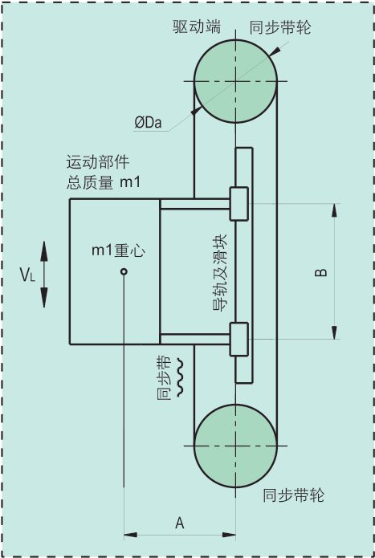
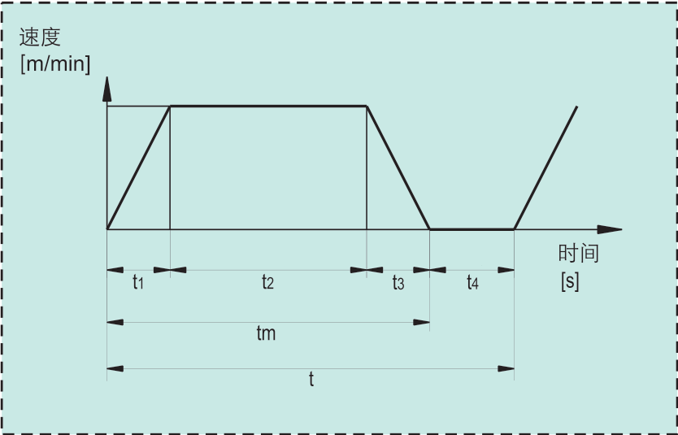

# 同步带垂直运动负载计算和伺服选型

|                     机构模型示意图                      |                      时间位移曲线                       |
| :-----------------------------------------------------: | :-----------------------------------------------------: |
|  |  |

## 条件

1. 直线运动部的总质量m1=7kg。
2. 直线运动部的最高速度VL=120m/min。
3. 电气停止精度δ=±0.05mm。
4. 滑块摩擦系数μ1=0.1。
5. 机械传动链总效率η1=0.95。
7. 滚珠丝杆的长度L1=1.4m。
8. 同步带轮直径Da=0.064m。
9. 同步带轮宽度w=15mm。
10. 每个同步带轮的质量m2=0.22kg。
12. 运行周期t=1.5s。
13. 加减速时间t1=t3=0.1s。

## 计算

### 运动曲线

​	由：
$$
L_1
=\frac{1}{2}\times \frac{V_L}{60}\times t_1+\frac{V_L}{60}\times t_2+\frac{1}{2}\times \frac{V_L}{60}\times t_3
$$
​	推出：
$$
t_2=\frac{60\times L_1}{V_L}-t_1=\frac{60\times 1.4}{120}-0.1=0.6s
$$
​	每分钟运行次数：
$$
N_{每分钟运行次数}=\frac{60}{1.5}=40
$$
​	加速每分钟运行时间：
$$
t_5=t_1\times N =0.1\times 40=4s
$$
​		每分钟伺服电机加速累计运行时间一般要求在10s以内，条件满足。

### 计算最高负载转速

$$
n_1=\frac{V_L}{\pi \times D_a}=\frac{120}{3.14\times 0.064}≈597.1r/min
$$

### 计算连续最大负载转矩

​	负载为偏载型，导轨的摩擦力
$$
F_1=\mu_1 m_1g\times \frac{A}{B}+F_2=0.1\times 7\times 9.8+30=36.86N\\
$$
​		滑块的摩擦阻力F2 ，取F2=30N。取A=B。

​	连续最大负载转矩：
$$
M_1=\frac{(F_1+m_1g)D_a}{2\eta_1}=\frac{(36.86+7\times 9.8)\times 0.064}{2\times 0.95}
=3.55N.m
$$

​	额定转矩应满足
$$
M_2=S_1\times M_1=1.5\times 3.55=5.33N.m
$$
​		S1为安全系数，一般S1≥1.5，取S1=1.5

### 计算负载惯量

​	直线运动部的转动惯量：
$$
J_1=\frac{m_1\times {D_a}^2}{4}=\frac{7\times 0.064^2}{4}=71.68\times 10^{-4}kg.m^2
$$
​	同步带轮的转动惯量：
$$
J_2=\frac{m_2\times {D_a}^2}{8}=\frac{0.22\times 0.064^2}{8}=1.1264\times 10^{-4}kg.m^2
$$
​	负载惯量
$$
J_3=J_1+2J_2=(71.86+2\times 1.1264)\times10^{-4}
=73.93\times 10^{-4}kg.m^2
$$

#### 计算加速瞬时转矩

​	最大加速瞬时转矩：
$$
M_3=\frac{2\pi \times n_1\times J_3}{60\times t_1}+M_1
=\frac{2\times 3.14\times 597.1\times 73.93\times 10^{-4}}{60\times 0.1}+3.55
=8.17N.m
$$
​	瞬间转矩应满足：
$$
M_4=S_2\times M_3=2\times 8.17=16.34N.m
$$
​		S2为安全系数，一般S2≥2，取S2=2。

### 选型

​	查看伺服电机手册参数：

​		额定转速nm＞n1，

​		额定转矩Mm1＞M2，

​		瞬间转矩Mm2＞M4，

​		减速比i。

​		伺服电机转子惯量Jm，伺服电机转子惯量用与计算惯量比，一般推荐惯量比小于20。

​	注意：为防负载自行下坠，必须采用带失电制动器的伺服减速电机。

### 惯量比

$$
J_R=\frac{J_4}{J_m\times i^2}
$$

​	一般推荐惯量比应小于20。

### 标准法兰伺服减速电机径向负载验算

​	同步带预紧力，由工况取F3=50N。

​	加速瞬间转矩产生的切向力
$$
F_4=\frac{2\times M_4}{D_a}=\frac{2\times 16.34}{0.064}=510.6N
$$
​	减速机输出端承受的径向力
$$
F_5=F_3+F_4=50+510.6=560.6N
$$
​	查标准法兰轴向容许负载表，径向容许负载

​	。。。。。。。。。。。。。。

----------------

