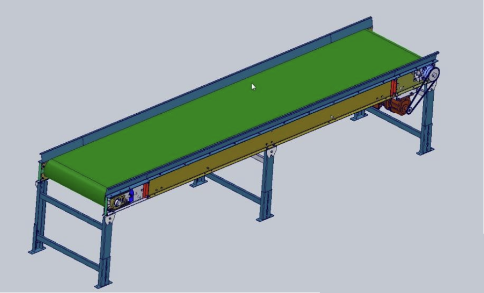

# 皮带输送机


:::{admonition} 已知
:class: note
1. 皮带输送机负载重量400kg
2. 速度30m/min
3. 滚子直径200mm
4. 总效率η=0.75
5. 摩擦系数0.2
6. 安全系数k=1.8
7. 求：电机功率，转速扭矩，减速比，求大小链轮齿数
:::

## 解法一

:::{admonition} 1.  输送重物产生的摩擦力
:class: tip
```{math}
F=\mu mg=0.2\times 400\times 10=800N
```
:::

:::{admonition} 2.  输送重物产生的摩擦力
:class: tip
```{math}
P=\frac{F\times v\times k}{\eta } =\frac{800\times 0.5\times 1.8}{0.75} =0.96kW(取1kW)
```
:::

:::{admonition} 3.  负载运动所需转速
:class: tip
```{math}
N=\frac{v\times 1000\times 60}{2\pi R} =\frac{30\times 1000\times 60}{2\times 3.14\times 100}=48r/min
```
:::

:::{admonition} 4.  设电机转速为1500 则电机转矩T
:class: tip
```{math}
T=\frac{P\times 9.55}{1500} =6.1N.m
```
:::

:::{admonition} 5.  则减速比i为
:class: tip
```{math}
i=\frac{1500}{48} =31.25(取31)(选择10)
```
:::

:::{admonition} 6.  设小链轮齿数为17 则大链轮齿为
:class: tip
```{math}
17\times 3.1=53
```
:::


## 解法二

:::{admonition} 1.  皮带带动负载运动所需的摩擦力F
:class: tip
```{math}
F=\mu mg=0.2\times 400\times 10=800N
```
:::

:::{admonition} 2.  滚子转矩T
:class: tip
```{math}
T_{滚子转矩} =\frac{FD}{2} =\frac{800\times 0.2}{2}=80N.m
```
:::

:::{admonition} 3.  负载运动所需转速
:class: tip
```{math}
N=\frac{v\times 1000\times 60}{2\pi R} =\frac{30\times 1000\times 60}{2\times 3.14\times 100}=48r/min
```
:::

:::{admonition} 4.  则减速比i为
:class: tip
```{math}
i=\frac{1500}{48} =31.25(取31)(选择10)
```
:::


:::{admonition} 5.  设小链轮齿数为17 则大链轮齿为
:class: tip
```{math}
17\times 3.1=53
```
:::

:::{admonition} 6.  电机的扭矩
:class: tip
```{math}
T=\frac{T_{滚子转矩} }{i} =\frac{80}{31} =2.58N.m
```
:::

:::{admonition} 7.  电机需要的理论功率为P
:class: tip
```{math}
P=\frac{T\times N }{9550} =\frac{2.58\times 1500}{9550} =0.4kW
```
:::

:::{admonition} 8.  电机实际功率等于
:class: tip
```{math}
P=\frac{P\times k }{\eta } =\frac{0.4\times 1.8}{0.75} =0.96kW(取1kW)
```
:::


