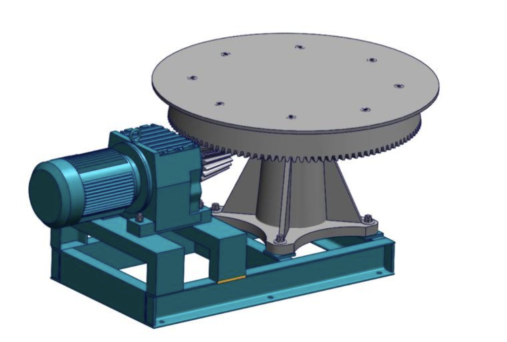

## 转盘模型

**已知惯量47.48kg.mm 转速12R/min 重量395KG 设电机转速为1500 加速时间0.5s 小齿轮齿数为20 大齿轮齿数120 设安全系数为k=1.5 效率η=0.7**

**求：减速比 电机功率**

**转台转速：**
$$
\omega_{转台转速} =\frac{2\pi N}{60} =\frac{2\times 3.14\times 12}{60} =1.256rad/s
$$
**转台角加速度**
$$
\beta_{转台角加速度} =\frac{\omega }{t} =\frac{1.256}{0.5} =2.512rad/s
$$
**转台所需转矩**
$$
T_{转台转矩}=J\times \beta =47.4847\times 2.512=119.2N.m
$$
**减速比**
$$
i =\frac{n_{电机} }{n_{负载}} =\frac{1500}{12} =125
$$
**齿轮间的减速比**
$$
i_{齿轮间的减速比} =\frac{n_{大齿轮齿数} }{n_{小齿轮齿数}} =\frac{1200}{20} =6
$$
**减速机的减速比**
$$
i_{减速机的减速比} =\frac{n_{电机} }{n_{负载}} =\frac{125}{6} =20.8(取20)
$$
**电机所需转矩**
$$
T_{电机所需要的扭矩} =\frac{T}{i} =\frac{119.2}{125} =0.95Nm
$$
**电机所需理论功率**
$$
P_{电机理论功率} =\frac{TN}{9550} =\frac{0.95\times 1550}{9550} =0.15kW
$$
**电机所需实际功率**
$$
P_{电机实际功率} =\frac{P_{电机理论功率}\times k}{\eta } =\frac{0.15\times 1.5}{0.7} =0.32kW(取0.4kW)
$$

