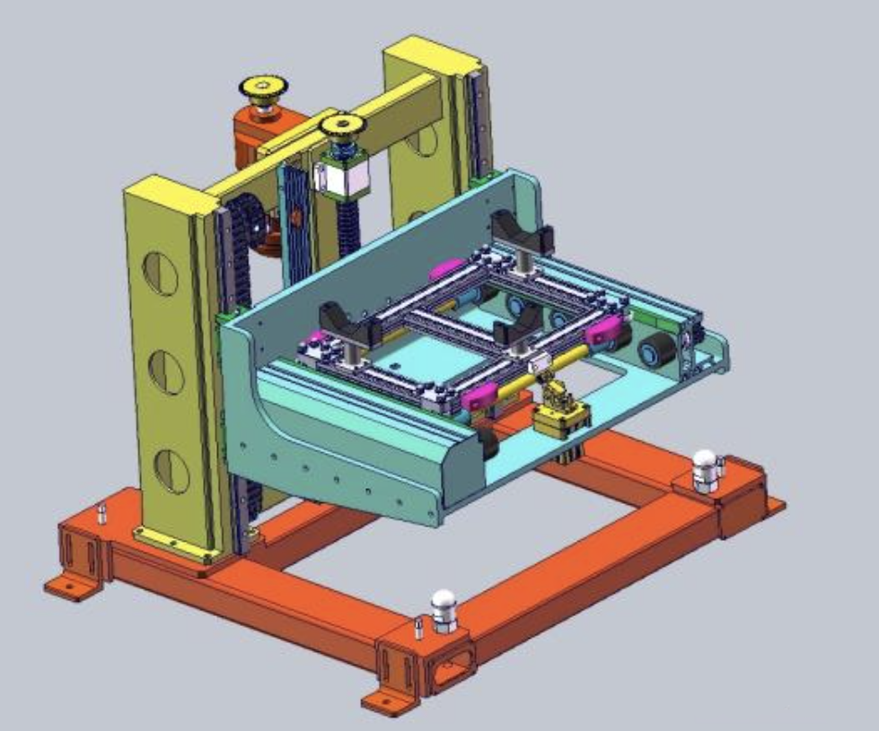

## 丝杆模型（负载上下运动）

**已知：负载500kg 速度0.2m/s n电机转速为1500r/min Pb丝杆导程20mm**
**总效率η=0.8 安全系数k=1.5 （减速机最大传动比为10）**

**求电机功率P，减速比i，大小链轮齿数**

**负载重力**
$$
F=mg=500\times 10=5000N
$$

**丝杆转矩**
$$
T=\frac{F\times Pb}{2\pi } = \frac{5000\times 0.02}{2\times 3.14 }=16N.m
$$

**丝杆转速**
$$
N=\frac{v\times 60\times 1000}{Pb} =\frac{0.2\times 60\times 1000}{Pb}=600r/min
$$

**减速比**
$$
i=\frac{n_{电机} }{n_{丝杆}} =\frac{1500 }{600}=2.5
$$

**电机转矩**
$$
T_{电机}=\frac{T_{负载} }{i} =\frac{16 }{2.5}=6.4
$$

**电机理论功率**
$$
P_{电机理论功率} =\frac{Tn}{9550} =\frac{6.4\times 1500}{9550} =1kW
$$
**电机实际功率**
$$
P_{电机实际功率} =\frac{P\times k}{9550} =\frac{1\times 1.5}{0.8} =1.875kW(取2.2kW)
$$
**设减速机减速比为2，则链轮之间的传动比为**
$$
i_{链轮之间的传动比} =\frac{2.5}{2} =1.25
$$
**设小链轮齿数为17**
$$
\frac{17}{1.25} =21
$$
（注意：减速机的减速比根据实际情况而定，可以直接设为2.5 或是不带减速机，或是其他参数）

