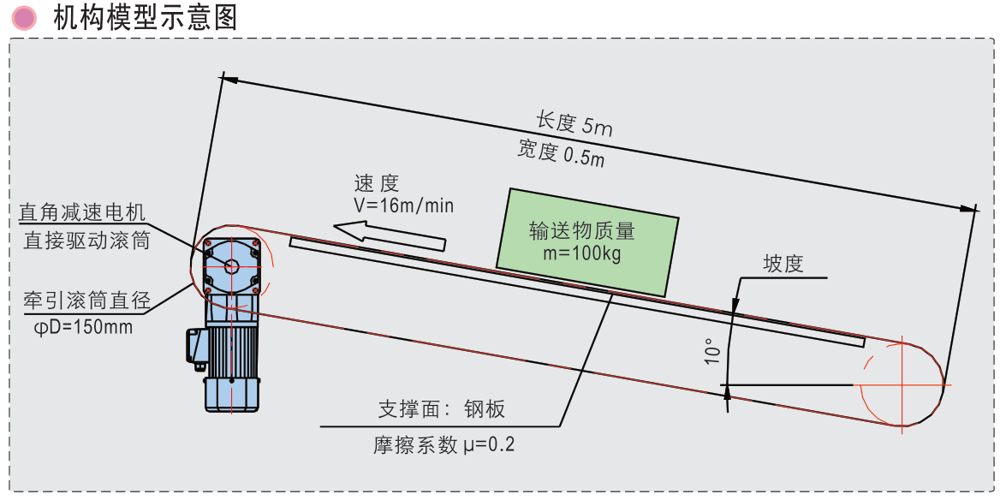

# 上坡平皮带负载计算和选型设计



## 条件

:::{admonition} 已知
:class: note
1. 输送方式：上坡输送，输送物最大质量m=100kg。seealso
2. 牵引滚筒直径D=150mm，半径R=75mm。
3. 输送速度V=16m/min。
4. 坡度θ=10°。
5. 支撑面：钢板，摩擦系数μ=0.2。
6. 机械结构：直角减速电机直驱。
7. 运转模式：连续运转。
:::

## 计算


:::{admonition} 1.  输送重物产生的摩擦力
:class: tip
```{math}
M1=umg\cos \theta R=0.2\times 9.8\times \cos 10°\times 0.075=14.48N.m
```
:::


:::{admonition} 2.  测量无输送时，输送带自身空转所需转矩M2
:class: tip
$$
M2=10N.m
$$
结合实际，根据经验。
:::


:::{admonition} 3.  输送物上坡产生的提升分力负载转矩M3
:class: tip
$$
M3=mg\sin \theta R=100\times 9.8\times \sin 10°\times 0.075=12.76N.m
$$
注：若水平运动，则M3=0。
:::


::::{admonition} 4.  总负载转矩M
:class: tip
$$
M=(M1+M2+M3)\times 1.5=(14.48+10+12.76)\times 1.5=55.86N.m\\
$$
注：S为安全系数，推荐值为1.5~2。\

:::{admonition} 若输送带为频繁启停的运转情况，则起动时总负载转矩还需要考虑加速度转转矩
:class: seealso
$$
\begin{gather*}
M=(M1+M2+M3+M4)\times 1.5\\
a=\frac{v1-v0}{t}\\
M4=F_a\times R=ma\times R
\end{gather*}
$$
:::

::::

### 减速电机转速
:::{admonition} 减速电机转速
:class: tip
$$
n=\frac{v}{\pi D}=\frac{16}{3.14\times 0.15}=34r/min
$$
:::

### 减速电机功率
:::{admonition} 减速电机功率
:class: tip
$$
P=\frac{Mn}{9.55\eta }=\frac{55.86}{9.55\times 0.8}=249W
$$

注：若采用单相电机，因单相电机启动转矩仅为额定转矩的0.7倍，故减速电机功率应加大1÷0.7=1.43倍
:::


**选择电机**

​	**以P＞249W、M＞55.86N.m、n=34r/min(查精研手册选择电机)。**


