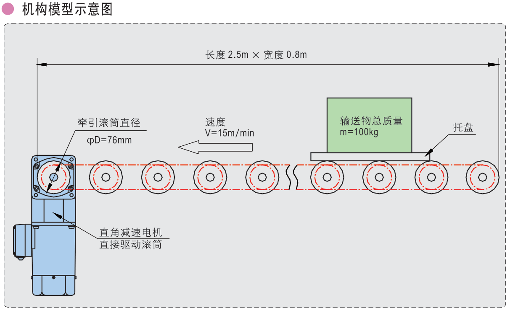

# 滚筒输送带负载计算和选型设计

## 条件

1. 托盘与重物总输送物最大质量m=100kg。
3. 牵引滚筒直径D=76mm，半径R=38mm。
4. 托盘输送速度V=15m/min。
5. 支撑方式：托盘与滚轮的滚动摩擦系数μ=0.1。
6. 运转模式：频繁启停。

## 计算

### 托盘产生的滚动摩擦转矩M1

$$
M1=umg R=0.1\times 100\times 9.8\times 0.038=3.72N.m
$$

### 测量无输送时，输送带自身空转所需转矩M2

$$
M2=5N.m
$$

​	注：结合实际，根据经验。

### 启动时重物的加速度转矩M3

设从0加速到15m/min需要0.5s时间
$$
a=\frac{v_1-v_0}{t}=\frac{15{\div}60-0}{0.5}=0.5m/s^2
$$

$$
M3=F_a×R=ma×R=100×0.5×0.038=1.9N.m
$$

### 启动时滚筒的加速度转矩M4

设输送带滚筒数量为20个，每个滚筒重量为5kg
$$
J_{每支滚筒的转动惯量}=\frac{mR^2}{2}=\frac{5×0.038^2}{2}=0.0036kg.m^2
$$

$$
\alpha_{滚筒的角加速度}=\frac{a}{R}=\frac{0.5}{0.038}=13.16rad/s^2
$$

$$
M4=J_{每支滚筒的转动惯量}×\alpha_{滚筒的角加速度}×20=0.0036×13.16×20=0.95N.m
$$

### 总负载转矩M

$$
M=(M1+M2+M3+M4)\times 1.5=(3.72+5+1.9+0.95)\times 1.5=17.35N.m\\
$$

​	注：S为安全系数，推荐值为1.5~2。

**若输送带有跑偏情况，还需计算跑偏摩擦转矩M4**
$$
M=(M1+M2+M3+M4+M5)\times 1.5
$$

$$
M5=m\times g\times K\times \mu _1\times R，(单位：N.m)\\
$$

​	K:侧向负载系数，参考值0.2~0.3。

​	μ1:托盘与侧边条滑动摩擦系数，参考值为0.2~0.3。

### 减速电机转速

$$
n=\frac{v}{\pi D}=\frac{15}{3.14\times 0.076}=62.8r/min
$$

### 减速电机功率

$$
P=\frac{Mn}{9.55\eta }=\frac{17.35\times 68.2}{9.55\times 0.7}=163W
$$

​	注：若采用单相电机，因单相电机启动转矩仅为额定转矩的0.7倍，故减速电机功率应加大1÷0.7=1.43倍。

### 选择电机

​	**以P＞163W、M＞17.35N.m、n=62.8r/min(查精研手册选择电机)。**

