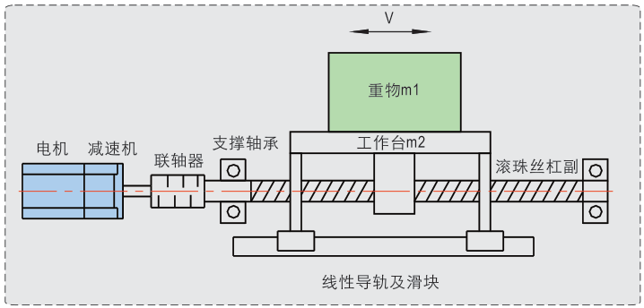
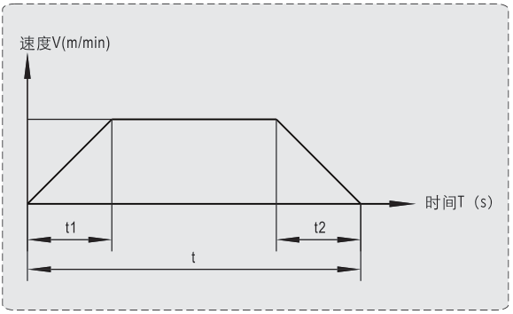

# 水平运动滚珠丝杆负载计算和选型设计

|                        机构模型示意图                        |                         时间位移曲线                         |
| :----------------------------------------------------------: | :----------------------------------------------------------: |
|  |  |

## 条件

1. 重物m1=120kg。
2. 工作台质量（可移动部分）m2=15kg。
3. 行程L=200mm。
4. 单程运动时间要求T≤6s。
5. 滚珠丝杠公称直径D=25mm。
6. 滚珠丝杠导程Ph=25mm。
7. 滚珠丝杠总长度Lb=450mm。
8. 滚珠丝杠机械效率η=0.9（滑动丝杠η=0.3~0.6）。
9. 线性导轨与滑块摩擦系数μ=0.1（按极端情况取经验值）。

## 计算

### 速度计算

设加减速加速度a=0.05m/s2，加减速时间t1及t2均为1s，，匀速运动速度v=50mm/s，则：

丝杠最高转速
$$
n=\frac{V}{Ph}=\frac{50}{25}=2rps=120rpm
$$
加减速总运行距离
$$
L=\frac{a{t_1}^2}{2}+\frac{a{t_2}^2}{2}=\frac{0.05\times {1}^2}{2}+\frac{0.05\times {1}^2}{2}=0.05m=50mm
$$
匀速运行距离
$$
200-50=150mm
$$
匀速运行时间
$$
150\div 30=3s
$$
则：

单行程实际运行时间为
$$
3+1+1=5s<6s
$$
运行时间小于T，满足运行时间要求。

### 滑块摩擦力F1，滑块自有阻力F2

$$
F1=\mu(m_1+m_2)g=0.1\times (120+15)\times 9.8=132.3N
$$

线性导轨和滑块预紧及密封阻力F2

设：单个滑块阻力f=2N，滑块数量4个。
$$
F2=4\times 2=8N
$$

### 由滑块摩擦力产生的摩擦转矩M1

$$
M1=\frac{FPh}{2\pi \eta}=\frac{(F1+F2)Ph}{2\pi \eta}=\frac{(132.3+8)\times0.025}{2\times 3.14 \times 0.9}=0.621N.m
$$

### 由滚珠丝杠副预紧力及支撑轴承产生的摩擦转矩M2

$$
M2=1N.m(预估，若条件允许可实测)
$$

### 总惯量

丝杆惯量J1
$$
J1=\frac{\pi \rho}{32}\times D^4\times Lb=\frac{3.14\times 7900}{32}\times (25\times 10^{-3})^4\times 450\times 10^{-3}=1.36\times 10^{-4}kg.m^2
$$
水平运动部分惯量J2
$$
J2=(m1+m2)\times (\frac{Ph}{2\pi})^2=(120+15)\times (\frac{25\times 10^{-3}}{2\pi})^2=21.4\times 10^{-4}kg.m^2
$$
联轴器惯量J3
$$
J3=0.04\times 10^{-4}kg.m^2
$$
总惯量J
$$
J=J1+J2+J3=(1.36+21.4+0.04)\times 10^{-4}=22.8\times 10^{-4}kg.m^2
$$

### 加速时由惯量产生的负载转矩M3

$$
\alpha_{角加速度}=\frac{120}{60}\times 2\pi=12.56rad/s^2\\
M3=J\times \alpha_{角加速度}=22.8\times 10^{-4}\times 12.56=0.029N.m
$$

### 总负载转矩M

$$
M=(M1+M2+M3)\times 1.75=(0.621+1+0.029)\times 1.75=2.88N.m\\
$$

​	注：S为安全系数，推荐值为1.5~2。

### 选择电机

​	**以M＞2.88N.m、n=120rpm(查精研手册选择电机)。**

