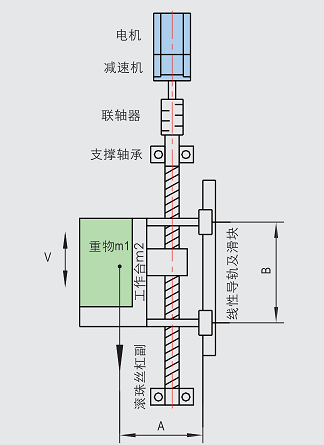
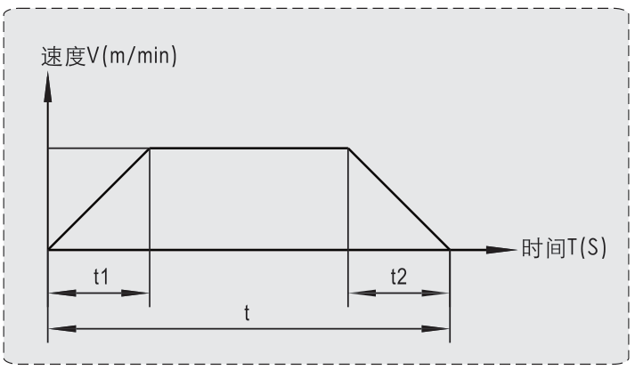

# 垂直运动滚珠丝杆负载计算和选型设计

|                     机构模型示意图                      |                         时间位移曲线                         |
| :-----------------------------------------------------: | :----------------------------------------------------------: |
|  |  |

## 条件

1. 重物m1=300kg。
2. 工作台质量（可移动部分）m2=30kg。
3. 行程L=850mm。
4. 单程运动时间要求T≤45s。
5. 滚珠丝杠公称直径D=32mm。
6. 滚珠丝杠导程Ph=25mm。
7. 滚珠丝杠总长度Lb=1000mm。
8. 滚珠丝杠机械效率η=0.9（滑动丝杠η=0.3~0.6）。
9. 线性导轨与滑块摩擦系数μ=0.1（按极端情况取经验值）。

## 计算

### 速度计算

设加减速加速度a=0.025m/s2，加减速时间t1及t2均为1s，，匀速运动速度v=25mm/s，则：

丝杠最高转速
$$
n=\frac{V}{Ph}=\frac{25}{25}=1rps=60rpm
$$
加减速总运行距离
$$
L=\frac{a{t_1}^2}{2}+\frac{a{t_2}^2}{2}=\frac{0.025\times {1}^2}{2}+\frac{0.025\times {1}^2}{2}=0.025m=25mm
$$
匀速运行距离
$$
850-25=825mm
$$
匀速运行时间
$$
825\div 25=33s
$$
则：

单行程实际运行时间为
$$
33+1+1=35s<45s
$$
运行时间小于T，满足运行时间要求。

### 负载为偏载型，滑块摩擦力F1，滑块自有阻力F2

设A=B
$$
F1=\mu(m_1+m_2)g\times A \div B=0.1\times (300+30)\times 9.8\times A \div B=323.4N
$$

线性导轨和滑块预紧及密封阻力F2

设：单个滑块阻力f=5N，滑块数量4个。
$$
F2=4\times 5=20N
$$

### 由滑块摩擦力产生的摩擦转矩M1

$$
M1=\frac{FPh}{2\pi \eta}=\frac{(F1+F2+m_1g+m_2g)Ph}{2\pi \eta}=\frac{(323.4+20+300\times 9.8+ 30\times 9.8)\times0.025}{2\times 3.14 \times 0.9}=15.8N.m
$$

### 由滚珠丝杠副预紧力及支撑轴承产生的摩擦转矩M2

$$
M2=1N.m(预估，若条件允许可实测)
$$

### 总惯量J

丝杆惯量J1
$$
J1=\frac{\pi \rho}{32}\times D^4\times Lb
=\frac{3.14\times 7900}{32}\times (32\times 10^{-3})^4\times 1000\times 10^{-3}
=8.13\times 10^{-4}kg.m^2
$$
水平运动部分惯量J2
$$
J2=(m1+m2)\times (\frac{Ph}{2\pi})^2
=(300+30)\times (\frac{25\times 10^{-3}}{2\pi})^2
=5.23\times 10^{-3}kg.m^2
$$
联轴器惯量J3
$$
J3=0.04\times 10^{-4}kg.m^2
$$
总惯量J
$$
J=J1+J2+J3
=(8.13+52.3+0.04)\times 10^{-4}
=60.47\times 10^{-4}kg.m^2
$$

### 加速时由惯量产生的负载转矩M3

$$
\alpha_{角加速度}=\frac{60}{60}\times 2\pi=6.28rad/s^2\\
M3=J\times \alpha_{角加速度}=60.47\times 10^{-4}\times 6.28=0.038N.m
$$

### 总负载转矩M

$$
M=(M1+M2+M3)\times 2=(15.8+1+0.038)\times 2=33.7N.m\\
$$

​	注：S为安全系数，推荐值为1.5~2。

### 选择电机

​	**以M＞33.7N.m、n=60rpm(查精研手册选择电机)。**

